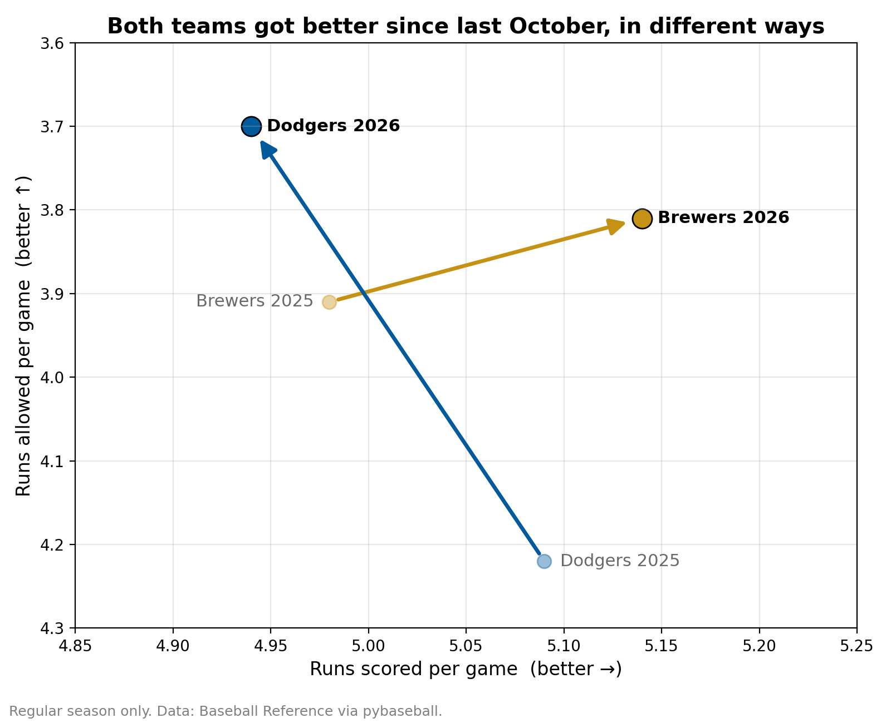
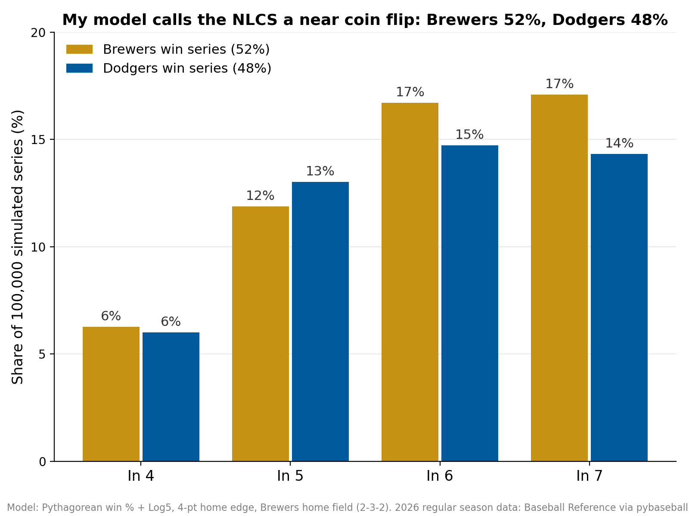
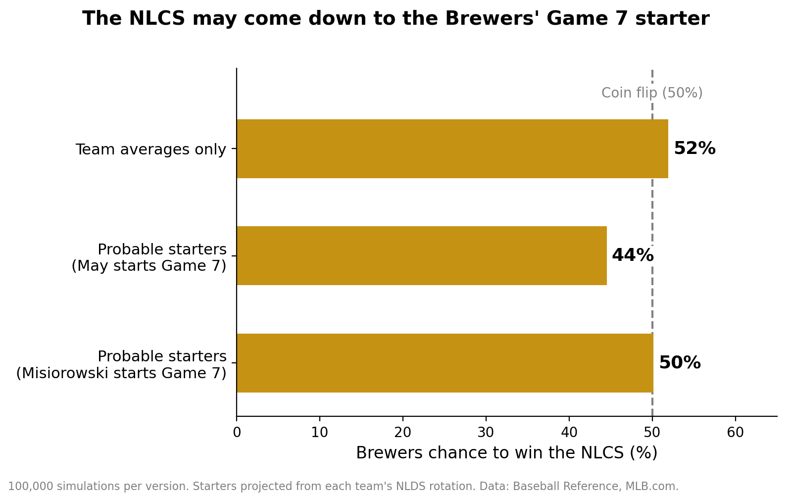

# Brewers vs. Dodgers: 2026 NLCS Preview

A data-driven preview of the 2026 NLCS between the Milwaukee Brewers and Los Angeles Dodgers, built in Python. The project compares both teams' 2025 and 2026 regular seasons, then uses a simulation model, first with team averages and then with probable starting pitchers, to estimate each team's chances of winning the series.

**The question:** Third time's a charm for the Brewers, or a third straight World Series trip for the Dodgers? The Dodgers beat Milwaukee in the 2018 NLCS (Game 7) and swept them in the 2025 NLCS. Is this year different?

## Key findings

| | Brewers | Dodgers |
|---|---|---|
| 2026 record | 103-59 (best in MLB) | 100-62 |
| Run differential (2025 → 2026) | +172 → +214 | +142 → +201 |
| Runs scored per game (2025 → 2026) | 4.98 → 5.14 | 5.09 → 4.94 |
| Runs allowed per game (2025 → 2026) | 3.91 → 3.81 | 4.22 → 3.70 |

1. **Both teams are better than last October.** Each improved its run differential by 40+ runs.
2. **They improved in opposite ways.** The Brewers became the better offense; the Dodgers made a big jump in run prevention while their offense slipped.
3. **The regular season series may not tell us much.** The Brewers won the 2026 season series 4-3 but were outscored 27-25, largely due to one 11-3 loss. In 2025 they won all six regular-season meetings, then were swept in the NLCS.

## Prediction model

### Version 1: Team averages

1. **Pythagorean expectation** estimates each team's "true" winning percentage from runs scored and allowed (exponent 1.83).
2. **Log5** converts the two teams' strengths into a single-game win probability.
3. A **home-field adjustment** of 4 percentage points is applied to each game.
4. A **Monte Carlo simulation** plays the series 100,000 times using the real 2-3-2 home schedule (Brewers have home field).

**Result:** a near coin flip. Brewers 51.9%, Dodgers 48.1%.

### Version 2: Probable starting pitchers

Version 1 treats every game the same. Version 2 gives each game its own odds based on who is likely to start:

- Each team's run prevention for a game = **60% from that day's starter** (about 5-6 innings) + **40% from the team's season average** (the bullpen).
- Starter ERA is converted to total runs allowed (×1.08, since ERA excludes unearned runs).
- **Probable starters are projected from each team's NLDS rotation.** Only Misiorowski's Game 1 start was officially confirmed when this was built.

| Game | Where | Brewers | Dodgers |
|---|---|---|---|
| 1 | MIL | Misiorowski | Skubal |
| 2 | MIL | Henderson | Snell |
| 3 | LA | Dustin May | Yamamoto |
| 4 | LA | Gasser | Glasnow |
| 5 | LA | Misiorowski | Skubal |
| 6 | MIL | Henderson | Snell |
| 7 | MIL | Dustin May | Yamamoto |

**Scenario results (100,000 simulations each):**

| Scenario | Game 7 Brewers win % | Brewers in 6 | Brewers in 7 | Brewers win series |
|---|---|---|---|---|
| Rotation as projected (May starts Game 7) | 38.2% | 15.7% | 12.3% | **44.4%** |
| Drohan instead of Gasser in Game 4 | 38.2% | 15.4% | 12.3% | **43.5%** |
| Misiorowski starts Game 7 on short rest (~3-4 innings) | 56.1% | 15.7% | 18.0% | **50.1%** |

**Takeaways:**
- Knowing the starters flips the favorite: from Brewers 52% (version 1) to Dodgers 56%.
- The swing comes from Dustin May (4.72 ERA) lining up against Yamamoto in Games 3 and 7.
- The Game 4 starter barely matters (about 1 point). The Game 7 starter matters most: bringing Misiorowski back moves the series to a coin flip.

**My pick:** Brewers in 6, closing it out at home before a Game 7 is needed.

## Data and methods

- **Sources:** game-by-game results and 2026 pitcher stats from Baseball Reference via the `pybaseball` Python library.
- **Validation:** season records and run differentials were cross-checked against official MLB.com figures.
- **Data corrections:**
  - The source mixes regular season and postseason games, so team analysis uses only the first 162 completed games.
  - The 2025 data was missing each team's final regular-season game (September 28, 2025). Both games were added manually from verified box scores (Brewers 4, Reds 2; Dodgers 6, Mariners 1).
  - Misiorowski's ERA is listed as 1.86 on Baseball Reference and 1.80 on MLB.com (about one earned run apart, likely an official scoring change). The model uses the official MLB.com value.

## Limitations

- Runs are not adjusted for ballpark effects.
- Starters are projected, not announced, beyond Game 1.
- ERA can be noisy for pitchers with fewer innings (for example, Snell's 1.94 ERA comes from 46 innings).
- The 60/40 starter-bullpen split and the short-rest adjustment are simplifying assumptions.
- The model uses regular-season data only and has not been backtested on past postseason series. Backtesting would be the next step to measure its accuracy.

## How to run it

1. Install Anaconda (Python 3.13) and the data library: `pip install pybaseball`
2. Open `nlcs_analysis.ipynb` in VS Code or Jupyter.
3. Click **Run All**. The simulations use a fixed random seed, so results are reproducible.
4. To test a different rotation, edit the starter lists in the scenario cell and rerun.

## Tools

Python, pandas, matplotlib, pybaseball, Jupyter, VS Code, Git/GitHub

## About

Built by Izzy Pitre, a business analytics and finance student interested in sports analytics, roster construction, and data-driven decision making in baseball.